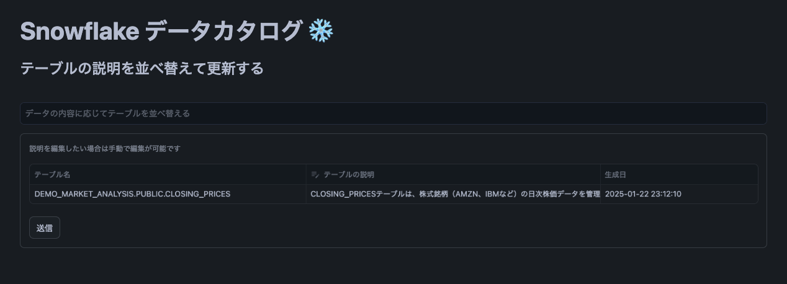
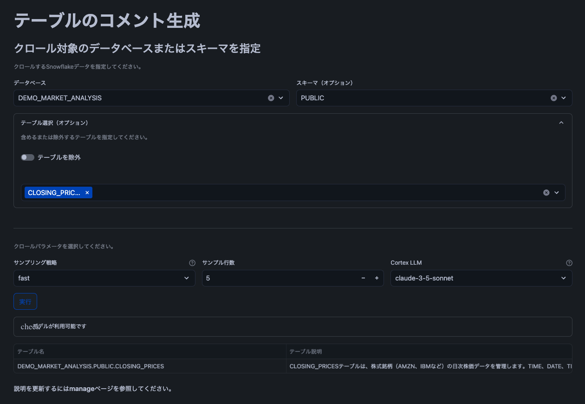

# データカタログアプリの概要
ここに掲載されているサンプルコードは、参照目的でのみ提供されています。このコードは「現状有姿」で提供され、いかなる保証も伴わないことにご注意ください。
Snowflake は、サンプルコードの使用に関するサポートは提供しません。

Copyright (c) 2024 Snowflake Inc. All Rights Reserved.

## 目的
データカタログアプリは、Snowflake データベースまたはスキーマに含まれる各テーブルの自然言語記述を生成し、生成した結果をデータカタログとして活用します。
コメント生成機能ではチームメンバーが容易に検索、レビュー、修正、および検索ができます。（コメント生成の機能は[こちらのコード](https://github.com/Snowflake-Labs/sfguide-data-crawler)を参考に修正を行なっています。）
データカタログではテーブルの検索、LLM によるテーブルの詳細説明と分析アイデアの提示、マーケットプレイスで公開されている類似外部データの提示を行いユーザのデータ活用を促進します。

## Data
LLM に渡されるプロンプトには、Snowflake テーブルのデータベース名、スキーマ名、テーブル名、カラム名、テーブルコメント (利用可能でユーザーが指定した場合)、およびテーブルデータのサンプルが含まれます。データベースまたはスキーマ内のテーブルをクロールできます。ユーザー指定のデータベースまたはスキーマをクロールする場合、ユーティリティを実行している現在のユーザーロールが読み取り可能なすべてのテーブルとビューが含まれます。テーブルの閲覧は、標準的な Snowflake ロールベースアクセス制御に従います。

## AI Security
Snowflake は、その AI 機能を強化する 3 種類の大規模言語モデル (LLM) をホストおよび/または管理しています。それは、Snowflake 独自の LLM、オープンソース LLM、およびライセンスされたプロプライエタリ LLM (総称して「LLM」) です。Snowflake の AI 機能は、データ保護、ガバナンス、およびセキュリティに関する Snowflake の標準的な責任共有モデルの対象となります。Snowflake は、お客様との信頼関係が基盤であることを理解しており、高水準のデータセキュリティとプライバシーを維持することに尽力しています。

## Cortex LLMs
Snowflake Cortex を使用すると、Mistral、Meta、Google などの企業の研究者によってトレーニングされた、業界をリードする大規模言語モデル (LLM) にすぐにアクセスできます。また、Snowflake が特定のユースケース向けに微調整したモデルも提供しています。これらの LLM は Snowflake によって完全にホストおよび管理されているため、使用するためにセットアップは不要です。お客様のデータは Snowflake 内に保持され、期待されるパフォーマンス、拡張性、およびガバナンスが提供されます。

# 利用方法
## 環境のセットアップ
SQL ファイル `setup.sql` を実行することで、Streamlit in Snowflake にデプロイされます。ファイルの内容は、Snowsight SQL ワークシートにコピー＆ペーストするか、Snowflake 拡張機能を備えた [VSCode](https://docs.snowflake.com/en/user-guide/vscode-ext)または[SnowCLI](https://docs.snowflake.com/en/developer-guide/snowflake-cli-v2/index)を介して実行できます。ファイルが実行されると、アプリケーションは Snowsight の Streamlit メニューから利用可能になります。

## Calling
必要なすべての関数とストアドプロシージャは、Snowflake の `DATA_CATALOG.TABLE_CATALOG` に登録されています。
現在のユーザー/ロールが利用できる任意のデータベースまたはスキーマをクロールできます。

Below is an example of calling the utility to crawl all tables and views in database `JSUMMER` schema `CATALOG`. Results will be written to table `DATA_CATALOG.TABLE_CATALOGTABLE_CATALOG`.
```sql
CALL DATA_CATALOG.TABLE_CATALOG.DATA_CATALOG(target_database => 'JSUMMER',
                                  catalog_database => 'DATA_CATALOG',
                                  catalog_schema => 'TABLE_CATALOG',
                                  catalog_table => 'TABLE_CATALOG',
                                  target_schema => 'CATALOG',
                                  sampling_mode => 'fast', 
                                  update_comment => FALSE
                                  );
```

> **Note:** Depending on your security practices, you may need to grant usage on the database, schema, and/or stored procedure to others.

The stored procedure provides a number of parameters:
| パラメータ        | 説明 |
| ------------     | ----------- |
| target_database  | カタログ化する Snowflake データベース。  
| catalog_database | テーブルカタログを格納する Snowflake データベース。
| catalog_schema   | テーブルカタログを格納する Snowflake スキーマ名。    
| catalog_table  | テーブルカタログを格納する Snowflake テーブル名    
| target_schema | カタログ化する Snowflake スキーマ。(オプション)   
| include_tables   | カタログに含めるテーブルの明示的なリスト。(オプション)     
| exclude_tables  | カタログから除外するテーブルの明示的なリスト。include_tables が exclude_tables より優先されます。(オプション)
| sampling_mode   | テーブルのサンプルデータレコードを取得する方法。['fast' (デフォルト)、'nonnull'] のいずれか。'nonnull' を渡すと、実行に時間がかかります。
| n | テーブルからサンプリングするレコード数。デフォルトは 5 です。    
| model   | テーブルの説明を生成する Cortex モデル。デフォルトは 'Claude 3.5 Sonnet' です。    
 
## Streamlit UI のイメージ
catalog ページの画面     |manage ページの画面     | run ページの画面
:--------------------:|:--------------------:|:-------------------------:
||

The final script creates a simple Streamlit user interface, `Data Crawler` with 2 pages:
- `catalog`: テーブルの検索、LLM によるテーブルの詳細説明と分析アイデアの提示、マーケットプレイスで公開されている類似外部データの提示。
- `manage`: テーブルの説明を検索、レビュー、および修正します。
- `run`: 新しいデータベースまたはスキーマ (あるいはその両方) を指定してクロールします。

## フィードバック
フィードバックをお待ちしております。 yota.itagaki@snowflake.com までご連絡ください。